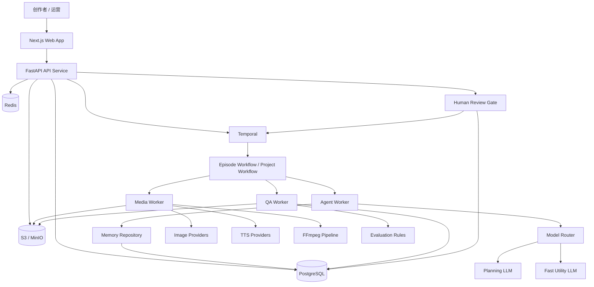
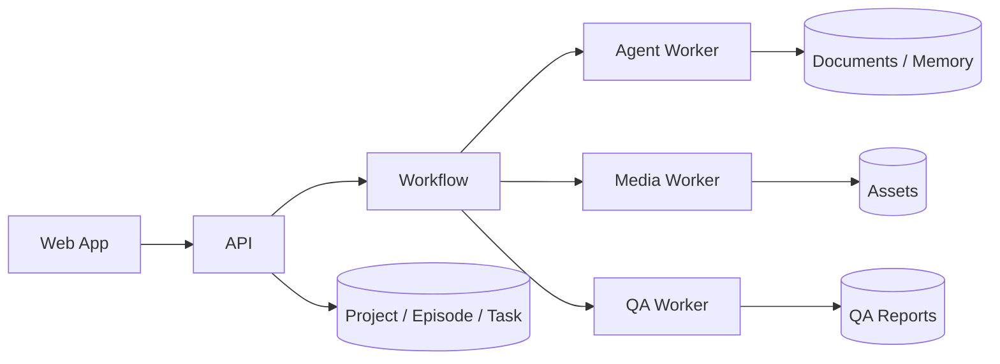
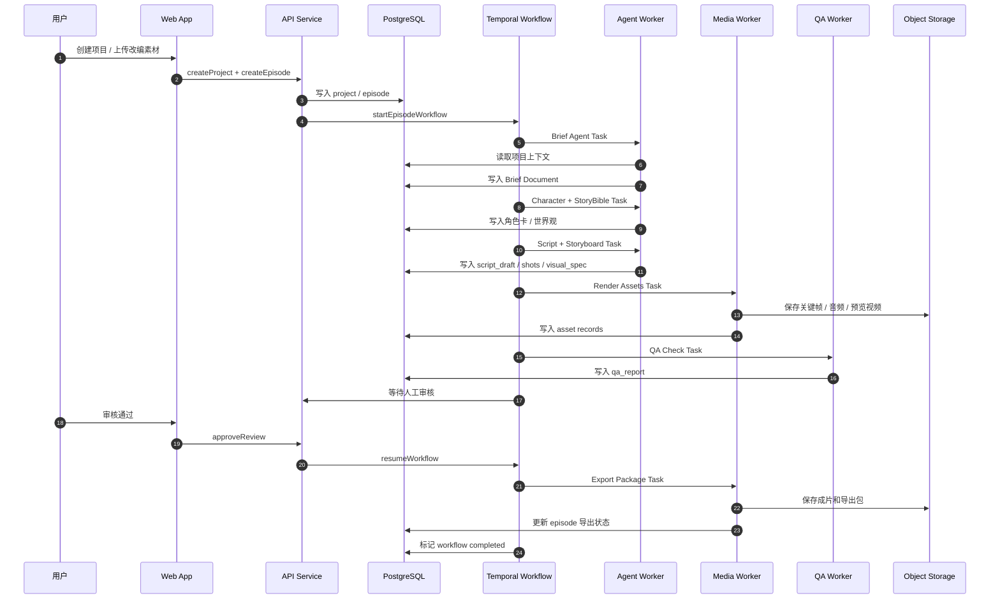
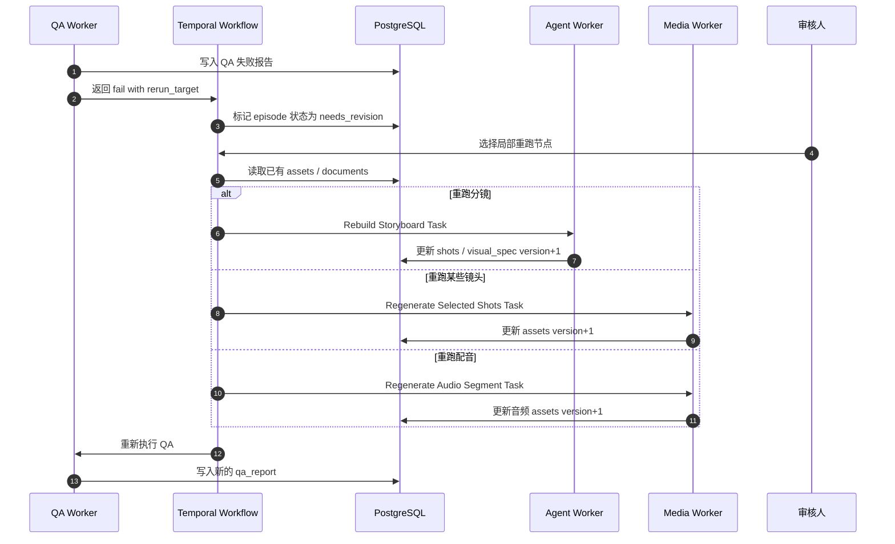
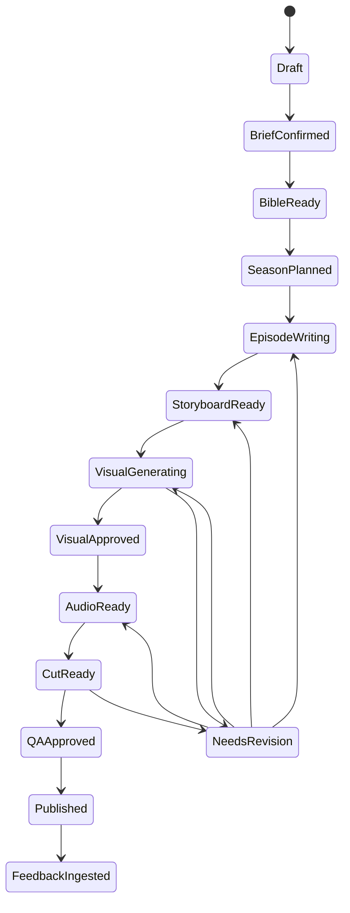

# AI漫剧产品设计

## 1. 项目定义

### 1.1 项目一句话
这是一个面向短内容创作者、MCN、IP工作室的 AI 漫剧生产平台，用结构化的 agent 流水线，把“一个创意”快速转成“可发布的漫剧成片”。

### 1.2 项目本质
它不是单纯的“AI 画图工具”，也不是单纯的“剧本生成器”。

它的本质是一个内容生产操作系统，负责把以下几个环节串起来：

1. 题材策划
2. 世界观与角色设定
3. 剧情拆解
4. 分镜与画面生成
5. 台词与配音
6. 剪辑包装
7. 发布与复盘

### 1.3 目标用户

#### 核心用户
1. 短剧/漫剧创作者
2. 小说推文转漫剧团队
3. MCN 内容工作室
4. IP 孵化团队

#### 非核心但可扩展用户
1. 品牌内容团队
2. 教育剧情化内容团队
3. 海外 webtoon/短剧出海团队

### 1.4 用户真正想买的不是“AI”，而是这三件事
1. 更快地产出一集能发的内容
2. 更稳定地保持角色和画风一致
3. 更低成本地跑通批量创作

## 2. 核心产品方向

### 2.1 推荐切入点
先做“创作者工作台”，不要一上来做“全自动内容工厂”。

原因：
1. 创作者工作台更容易验证真实需求
2. 人可以补足 AI 在剧情和审美上的不稳定
3. 更容易积累流程数据，后续再升级为批量自动生产

### 2.2 产品形态
产品可以分成两层：

#### 第一层：创作者工作台
用户输入一个题材、梗概、角色方向或原始小说片段，系统帮助用户生成一集漫剧，并在关键节点允许人工修改。

#### 第二层：内容工厂
基于已经验证过的 IP 模板、画风模板、角色模板和爆款结构，自动批量生成多集内容。

建议 MVP 只做第一层。

## 3. 产品核心原则

### 3.1 不做“agent 群聊”，做“流水线编排”
最重要的架构原则：

不要让多个 agent 互相自由聊天决定结果。

要让它们围绕统一的结构化项目记忆，在一个编排器控制下，分阶段地产出结果。

原因：
1. 自由群聊式 agent 成本高、不可控、难复现
2. 内容项目天然是阶段性生产，不是开放式讨论
3. 漫剧最重要的是一致性，而不是发散性
4. 商业系统需要可追踪、可回滚、可局部重跑

### 3.2 先保证结构一致，再追求创意上限
漫剧生产最容易崩的不是“灵感不够”，而是：
1. 人设跑偏
2. 分镜断裂
3. 画风不统一
4. 每一幕的角色长得不一样
5. 节奏不符合平台分发逻辑

所以系统要优先保证：
1. 角色设定一致
2. 场景设定一致
3. 每集结构稳定
4. 镜头语言稳定
5. 发布格式稳定

### 3.3 AI 负责提效，人类负责把关
不是所有环节都应该自动化。高价值节点要保留人工确认：

1. 立项和选题
2. 主角色设定定稿
3. 分集大纲确认
4. 分镜关键节点确认
5. 成片发布前审核

## 4. 产品功能全景

### 4.1 输入层
用户可以从以下入口开始：
1. 一个简单创意
2. 一段小说原文
3. 一个角色设定
4. 一条爆款漫剧参考链接
5. 一个已有 IP 的设定文档

### 4.2 生产层
系统要覆盖的生产模块：
1. 题材分析
2. 受众定位
3. 世界观生成
4. 角色设定生成
5. 分集规划
6. 单集剧本生成
7. 分镜脚本生成
8. 画面生成
9. 台词与字幕生成
10. 配音生成
11. 剪辑包装
12. 质检
13. 发布导出

### 4.3 管理层
系统要有项目管理能力：
1. 项目面板
2. 角色库
3. 世界观圣经
4. 分集树
5. 素材库
6. 任务状态流转
7. 版本管理
8. 结果回滚

### 4.4 学习层
系统应持续学习用户偏好：
1. 用户喜欢的剧情节奏
2. 用户常用的镜头风格
3. 用户选择过的角色外观
4. 不同平台的完播率表现
5. 哪类封面和标题更容易出结果

## 5. Agent 框架总设计

### 5.1 总体架构
推荐采用四层结构：

1. 编排层
2. 专业 agent 层
3. 共享记忆层
4. 执行与评估层

### 5.2 第一层：编排层
这一层负责控制整个项目状态机，决定什么时候调用哪个 agent。

核心组件：
1. Project Orchestrator，项目总编排器
2. Workflow Engine，工作流引擎
3. State Manager，状态管理器
4. Retry Controller，失败重试控制器
5. Human Review Gate，人工审核门

### 5.3 第二层：专业 agent 层
每个 agent 只做明确的一类工作，不做大而全。

推荐至少拆成以下 agent：

1. 立项策划 Agent
2. 世界观 Agent
3. 角色设定 Agent
4. 剧情规划 Agent
5. 单集编剧 Agent
6. 分镜 Agent
7. 视觉导演 Agent
8. 画面生成 Agent
9. 连续性检查 Agent
10. 台词与字幕 Agent
11. 配音 Agent
12. 剪辑包装 Agent
13. 质检 Agent
14. 发布 Agent
15. 数据复盘 Agent

### 5.4 第三层：共享记忆层
这是系统最关键的一层。所有 agent 都要围绕同一份项目真相工作。

共享记忆至少包括：
1. 项目 Brief
2. 用户目标
3. 受众画像
4. 世界观圣经
5. 角色卡
6. 场景库
7. 剧情树
8. 单集结构模板
9. 分镜资产
10. 视觉风格模板
11. 平台发布规格
12. 历史修改记录

### 5.5 第四层：执行与评估层
用于真正调用模型、生成素材、做质量判断。

包括：
1. LLM 路由器
2. 图像模型路由器
3. TTS 路由器
4. 视频合成器
5. 质量评估器
6. 成本监控器

## 6. Agent 之间的内部逻辑

### 6.1 推荐的总流程
完整链路建议如下：

1. 用户创建项目
2. 立项策划 Agent 生成项目 Brief
3. 世界观 Agent 输出世界观圣经
4. 角色设定 Agent 输出角色卡和关系图
5. 剧情规划 Agent 输出整季弧线和分集大纲
6. 单集编剧 Agent 输出当前集脚本
7. 分镜 Agent 把脚本拆成镜头表
8. 视觉导演 Agent 定义本集视觉执行方案
9. 画面生成 Agent 生成关键帧和镜头画面
10. 连续性检查 Agent 检查人物、服装、场景、道具一致性
11. 台词与字幕 Agent 生成对白稿、字幕稿
12. 配音 Agent 生成角色语音
13. 剪辑包装 Agent 合成视频、字幕、BGM、转场
14. 质检 Agent 做内容质量和平台适配检查
15. 发布 Agent 导出封面、标题、标签、平台版本
16. 数据复盘 Agent 基于发布数据给出下一集建议

### 6.2 推荐的交互方式
agent 之间不要直接无边界互相调用，推荐采用以下方式：

1. 上一个 agent 产出结构化结果
2. 结果写入共享记忆
3. 编排器根据状态机决定下一个 agent
4. 下一个 agent 只读取自己需要的上下文
5. 产出结果经过校验后再写回

也就是说：

不是 `Agent A -> 直接聊天给 Agent B -> Agent B 自行理解`

而是：

`Agent A -> 输出结构化对象 -> Memory -> Orchestrator -> Agent B`

这样做的好处：
1. 任何一步都可追踪
2. 某一步失败可以单独重跑
3. 不会因为 agent 聊天漂移导致系统失控
4. 更适合后续做数据分析和质量评估

### 6.3 每个 agent 的职责边界

#### 1. 立项策划 Agent
输入：
1. 用户创意
2. 目标平台
3. 目标受众

输出：
1. 项目定位
2. 题材标签
3. 核心卖点
4. 风格方向
5. 项目 Brief

不负责：
1. 具体分镜
2. 角色长相细节
3. 成片执行

#### 2. 世界观 Agent
输入：
1. 项目 Brief
2. 题材方向

输出：
1. 世界设定
2. 时间线
3. 规则体系
4. 禁忌与边界

不负责：
1. 单集剧情
2. 角色造型

#### 3. 角色设定 Agent
输入：
1. 项目 Brief
2. 世界观圣经

输出：
1. 角色卡
2. 角色关系网
3. 性格标签
4. 视觉描述
5. 口头禅和语言风格

不负责：
1. 分镜拆解
2. 具体画图参数

#### 4. 剧情规划 Agent
输入：
1. 世界观圣经
2. 角色卡
3. 平台时长要求

输出：
1. 整体故事弧线
2. 分集目标
3. 每集冲突点
4. 每集反转点

不负责：
1. 镜头级脚本

#### 5. 单集编剧 Agent
输入：
1. 当前集大纲
2. 角色卡
3. 世界观限制

输出：
1. 场次表
2. 台词初稿
3. 戏剧冲突设计
4. 情绪节奏曲线

不负责：
1. 画面生成
2. 音频合成

#### 6. 分镜 Agent
输入：
1. 单集剧本
2. 平台节奏模板

输出：
1. 镜头表
2. 镜头时长
3. 景别
4. 角色动作
5. 场景说明
6. 转场说明

不负责：
1. 最终画图

#### 7. 视觉导演 Agent
输入：
1. 分镜表
2. 角色卡
3. 风格模板

输出：
1. 每镜头视觉提示词策略
2. 人物出镜规则
3. 场景与光影规则
4. 镜头一致性约束

这个 agent 的作用很关键，它不是简单写 prompt，而是负责把“视觉语言”标准化。

#### 8. 画面生成 Agent
输入：
1. 镜头视觉规范
2. 人物参考图
3. 场景模板

输出：
1. 镜头图
2. 关键帧
3. 备用版本

不负责：
1. 判断剧情逻辑
2. 决定故事结构

#### 9. 连续性检查 Agent
输入：
1. 当前镜头图
2. 角色卡
3. 场景库
4. 上下镜头结果

输出：
1. 一致性评分
2. 错误清单
3. 重绘建议

主要检查：
1. 角色脸型是否漂移
2. 服装是否变了
3. 场景道具是否错位
4. 时间与空间逻辑是否断裂

#### 10. 台词与字幕 Agent
输入：
1. 单集剧本
2. 分镜节奏

输出：
1. 最终对白
2. 字幕切分
3. 强调词设计

#### 11. 配音 Agent
输入：
1. 台词稿
2. 角色音色配置
3. 情绪标签

输出：
1. 角色配音音频
2. 情绪变化版本

#### 12. 剪辑包装 Agent
输入：
1. 镜头图
2. 配音
3. 字幕
4. BGM 模板

输出：
1. 成片视频
2. 封面
3. 标题素材

#### 13. 质检 Agent
输入：
1. 成片
2. 平台要求
3. 项目设定

输出：
1. 质量报告
2. 风险提示
3. 是否允许发布

检查项：
1. 节奏是否拖沓
2. 字幕是否溢出
3. 声音是否对齐
4. 视觉是否穿帮
5. 是否触犯平台审核规则

#### 14. 发布 Agent
输入：
1. 成片
2. 项目定位
3. 平台策略

输出：
1. 标题
2. 封面文案
3. 标签
4. 发布版本

#### 15. 数据复盘 Agent
输入：
1. 完播率
2. 点赞率
3. 评论关键词
4. 转粉率

输出：
1. 下一集优化建议
2. 标题优化建议
3. 剧情节奏优化建议
4. 爆点保留建议

### 6.4 推荐的 agent 内部统一执行框架
虽然系统里有很多 agent，但它们的内部运行框架不应该各写各的。

建议所有 agent 统一遵循一套 8 段式内部流程：

1. Task Intake，接收任务
2. Context Hydration，加载上下文
3. Constraint Resolution，解析约束
4. Plan Draft，生成内部执行计划
5. Specialized Execution，执行本 agent 专业任务
6. Self Critique，自检与纠错
7. Schema Validation，结构化校验
8. Commit and Handoff，写回记忆并交接下游

统一逻辑可以写成：

`接任务 -> 读记忆 -> 明确目标与约束 -> 生成候选结果 -> 自检/评估 -> 结构化校验 -> 写回 Memory -> 通知 Orchestrator`

### 6.5 单个 agent 的标准内部节点
建议每个 agent 内部都至少有以下节点：

#### 1. Loader 节点
负责读取：
1. 当前任务对象
2. 上游产物
3. 项目长期记忆
4. 当前阶段模板

#### 2. Normalizer 节点
负责把自然语言需求转成结构化约束，例如：
1. 平台时长
2. 题材限制
3. 人设限制
4. 场景限制
5. 不允许触碰的审核边界

#### 3. Planner 节点
负责先规划后执行，避免直接一把梭生成。

#### 4. Generator/Worker 节点
负责真正生成本阶段结果。

#### 5. Critic 节点
负责检查：
1. 是否偏离 Brief
2. 是否和角色卡冲突
3. 是否和平台节奏冲突
4. 是否存在明显低质量模式

#### 6. Validator 节点
负责做严格 schema 校验、字段完整性校验、长度限制校验。

#### 7. Committer 节点
负责：
1. 结果版本化
2. 写入共享记忆
3. 标记状态推进
4. 记录回滚点

### 6.6 每个 agent 的内部流程逻辑

#### 1. 立项策划 Agent 内部流程
1. 解析用户输入，提取题材、受众、平台、时长、参考作品
2. 从模板库召回相近题材模板和历史高表现项目
3. 生成候选项目定位、核心卖点、内容钩子
4. 用 Critic 节点评估“是否够具体、是否够有传播性、是否过宽”
5. 输出项目 Brief、题材标签、受众画像、风险提示
6. 等待用户确认后写入长期记忆

#### 2. 世界观 Agent 内部流程
1. 读取项目 Brief 和题材模板
2. 生成世界规则、时间线、关键制度、禁忌边界
3. 做冲突校验，检查设定是否自相矛盾
4. 提炼成可约束后续剧情的“世界观圣经”
5. 输出规则优先级，标明硬规则和软规则
6. 写入 StoryBible

#### 3. 角色设定 Agent 内部流程
1. 读取项目 Brief、世界观圣经、目标受众偏好
2. 先生成角色功能位，再生成人物个性和关系
3. 生成角色视觉描述、服装锚点、口头禅、声音风格
4. 调用差异化检查，避免角色脸谱化或互相撞型
5. 输出角色卡、关系图、视觉锁定字段
6. 写入 CharacterProfile

#### 4. 剧情规划 Agent 内部流程
1. 读取角色卡、世界观、平台时长与集数目标
2. 先规划整季故事弧，再切分到每一集任务
3. 给每一集分配冲突、反转、高潮、结尾钩子
4. 检查是否存在“前几集无钩子”或“信息过载”
5. 输出 Season Arc 和 EpisodePlan 列表
6. 写入中期记忆

#### 5. 单集编剧 Agent 内部流程
1. 读取当前集 EpisodePlan、角色卡、世界规则
2. 把本集目标拆成若干场次目标
3. 先生成 beat sheet，再生成台词稿
4. 做节奏检查，控制前 5 到 8 秒冲突露出
5. 做角色语气检查，避免台词跑偏
6. 输出场次表、对白稿、情绪曲线

#### 6. 分镜 Agent 内部流程
1. 读取单集剧本和平台镜头模板
2. 按场次拆成 ShotCard
3. 为每个镜头定义景别、机位、动作、时长、转场
4. 检查镜头数量是否适合目标时长
5. 检查前后镜头动作逻辑是否连续
6. 输出结构化镜头表

#### 7. 视觉导演 Agent 内部流程
1. 读取 ShotCard、角色视觉锚点、风格模板
2. 为每个镜头生成画面构图策略，而不是直接写 prompt
3. 定义角色出镜规则、服装规则、道具规则、镜头光影规则
4. 把每个镜头打包成“可执行视觉规范”
5. 生成 prompt 包、negative prompt、参考图引用
6. 输出 VisualSpec

#### 8. 画面生成 Agent 内部流程
1. 读取 VisualSpec、角色参考图、场景模板
2. 选择模型和参数档位
3. 为每个镜头生成多候选版本
4. 对候选结果做自动评分，优先一致性而不是单张惊艳
5. 输出主版本、候补版本、生成日志
6. 保存资产并写入 AssetRecord

#### 9. 连续性检查 Agent 内部流程
1. 读取当前镜头资产、角色视觉锚点、相邻镜头
2. 对脸、服装、发型、配饰、场景、光线做对比
3. 给每个镜头打一致性分
4. 标记必须重绘、建议重绘、可放行镜头
5. 生成重绘指令，不直接修改剧情
6. 把结果交回编排器决定是否局部重跑

#### 10. 台词与字幕 Agent 内部流程
1. 读取剧本、镜头节奏、角色说话风格
2. 优化台词口语化程度和情绪张力
3. 按镜头和节奏切字幕
4. 检查单行长度、阅读速度、重点词高亮
5. 输出对白定稿、字幕文件、强调词方案
6. 写入字幕资产

#### 11. 配音 Agent 内部流程
1. 读取对白稿、角色音色模板、情绪标签
2. 选择 TTS 模型和声音档案
3. 逐角色合成多版本配音
4. 做时长和情绪校正
5. 检查嘴替可读性和音量均衡
6. 输出最终音频和备选音轨

#### 12. 剪辑包装 Agent 内部流程
1. 读取镜头资产、配音、字幕、BGM 模板
2. 拼接时间线，补充转场、放大、平移、震动等漫剧动效
3. 加字幕、音效、节奏点和片头片尾模板
4. 导出预览版和正式版
5. 产出封面截图位和短标题素材
6. 保存成片和工程元数据

#### 13. 质检 Agent 内部流程
1. 读取成片、平台规范、项目风格规则
2. 检查音画同步、字幕越界、时长、分辨率、节奏
3. 检查内容安全和平台审核风险
4. 生成 Pass/Fail 结论和问题列表
5. 标记问题应该回流到哪个节点修复
6. 把 QA 报告写回系统

#### 14. 发布 Agent 内部流程
1. 读取成片、项目定位、平台模板
2. 生成标题、封面文案、标签、简介
3. 生成不同平台导出版本
4. 给出推荐发布时间和封面样式建议
5. 输出发布素材包
6. 记录发布批次

#### 15. 数据复盘 Agent 内部流程
1. 拉取播放、完播、互动、转化、评论数据
2. 把数据映射回具体集数、场次、镜头、标题和封面
3. 分析高留存点、掉点、爆点、争议点
4. 更新模板库和选题权重
5. 生成下一集建议和系列级优化建议
6. 写回项目记忆和推荐系统

## 7. 推荐的状态机设计

### 7.1 项目级状态
一个项目建议有以下主状态：

1. Draft，初始草案
2. BriefConfirmed，立项确认
3. BibleReady，世界观与角色设定完成
4. SeasonPlanned，分集规划完成
5. EpisodeWriting，单集编写中
6. StoryboardReady，分镜完成
7. VisualGenerating，画面生成中
8. VisualApproved，画面通过
9. AudioReady，音频完成
10. CutReady，成片完成
11. QAApproved，质检通过
12. Published，已发布
13. FeedbackIngested，数据已回流

### 7.2 每个状态的规则
例如：

1. 只有 `BriefConfirmed` 之后才能进入世界观生成
2. 只有 `BibleReady` 之后才能做分集规划
3. 只有 `StoryboardReady` 之后才能批量出图
4. `VisualGenerating` 失败时，只重跑视觉相关 agent
5. `QAApproved` 失败时，返回对应节点修复，不重做全流程

### 7.3 重跑机制
系统必须支持局部重跑：

1. 重写当前集剧本
2. 仅重做某一场分镜
3. 仅重绘某几个镜头
4. 仅重配音某个角色
5. 仅修字幕和导出

这是商业可用性的关键。

## 8. 共享记忆设计

### 8.1 为什么共享记忆是核心
AI 漫剧最容易失败在“前面设定过，后面忘了”。

所以记忆层不能只是聊天记录，而要是结构化数据库。

### 8.2 推荐的核心对象

#### Project
包含：
1. 项目名
2. 类型
3. 平台
4. 目标用户
5. 风格方向
6. 当前状态

#### StoryBible
包含：
1. 世界观
2. 背景规则
3. 时间线
4. 禁忌规则

#### CharacterProfile
包含：
1. 姓名
2. 年龄段
3. 身份
4. 性格
5. 外观特征
6. 服装模板
7. 说话风格
8. 音色模板
9. 关系网

#### EpisodePlan
包含：
1. 集数
2. 本集目标
3. 冲突
4. 反转
5. 结尾钩子

#### SceneCard
包含：
1. 场次编号
2. 场景地点
3. 出场角色
4. 场景目标
5. 情绪值

#### ShotCard
包含：
1. 镜头编号
2. 景别
3. 构图
4. 动作
5. 时长
6. 生成素材引用

#### AssetRecord
包含：
1. 图像文件
2. 音频文件
3. 版本号
4. 来源 agent
5. 质量评分

### 8.3 记忆的三种层次

#### 长期记忆
不轻易变：
1. 世界观
2. 角色卡
3. 画风模板
4. 目标受众

#### 中期记忆
项目周期内反复使用：
1. 分集规划
2. 场景模板
3. 常用镜头模板

#### 短期记忆
当前任务上下文：
1. 当前集
2. 当前场
3. 当前镜头
4. 当前修正任务

## 9. 一个完整的 agent 流程示例

### 9.1 用户输入
用户输入：

“我想做一个女性向都市逆袭题材的 AI 漫剧，主角是被家族抛弃的千金，目标平台是抖音，每集 60 到 90 秒。”

### 9.2 系统执行

#### 第一步：立项策划 Agent
输出：
1. 题材：都市情感逆袭
2. 目标受众：18 到 30 岁女性
3. 爆点：身份反转、情感拉扯、打脸爽点
4. 节奏：前 8 秒给冲突，中间推进，结尾强钩子

#### 第二步：世界观 Agent
输出：
1. 城市背景
2. 豪门家族规则
3. 职场系统
4. 情感关系禁忌

#### 第三步：角色设定 Agent
输出：
1. 女主
2. 男主
3. 反派女配
4. 家族权力人物

#### 第四步：剧情规划 Agent
输出：
1. 前 10 集的剧情弧线
2. 每集反转点
3. 每集钩子

#### 第五步：单集编剧 Agent
输出第一集剧本：
1. 女主被羞辱
2. 男主第一次观察到她
3. 家族身份线埋伏笔
4. 结尾留下“她其实是谁”钩子

#### 第六步：分镜 Agent
输出 12 个镜头：
1. 羞辱现场远景
2. 女主表情特写
3. 反派挑衅近景
4. 男主视角镜头
5. 结尾高跟鞋停顿镜头

#### 第七步：视觉导演 Agent
给每个镜头定义：
1. 人物站位
2. 光影风格
3. 都市豪门视觉基调
4. 角色服装一致性要求

#### 第八步：画面生成 Agent
生成每个镜头的图像资产。

#### 第九步：连续性检查 Agent
发现：
1. 女主耳环在第 3 镜头消失
2. 男主西装颜色漂移
3. 场景灯光不一致

系统仅重绘对应镜头。

#### 第十步：台词、配音、剪辑
合成完整首集。

#### 第十一步：质检与发布
输出：
1. 竖屏版视频
2. 封面图
3. 标题
4. 话题标签

## 10. MVP 设计建议

### 10.1 MVP 不要做得太重
第一版建议只做以下闭环：

1. 输入创意
2. 生成项目 Brief
3. 生成人设和世界观
4. 生成单集大纲
5. 生成单集剧本
6. 生成分镜表
7. 生成关键帧图
8. 生成字幕和配音
9. 导出基础成片

### 10.2 MVP 先不要做的东西
先不要做：
1. 多平台自动分发
2. 全自动爆款复盘系统
3. 高复杂度协同编辑
4. 完整商业投放系统
5. 超复杂素材市场

### 10.3 MVP 的关键成功指标
1. 用户能在 30 到 60 分钟内做出第一集
2. 角色一致性明显优于手工拼接工作流
3. 每一集能稳定产出可发布版本
4. 用户愿意重复使用同一项目模板做第二集

## 11. 产品页面结构建议

### 11.1 首页
展示：
1. 新建项目
2. 从小说生成
3. 从模板生成
4. 最近项目

### 11.2 项目工作台
建议分成五栏：

1. 左侧：项目树
2. 中间：当前阶段编辑区
3. 右侧：agent 输出与建议
4. 底部：版本与任务记录
5. 顶部：阶段状态与一键推进

### 11.3 角色库页面
管理：
1. 角色卡
2. 外观参考
3. 台词风格
4. 音色

### 11.4 分镜页面
以卡片流形式展示：
1. 镜头
2. 文本描述
3. 参考图
4. 重绘按钮
5. 锁定按钮

### 11.5 成片页
展示：
1. 预览
2. 质检报告
3. 导出
4. 发布素材包

### 11.6 设计评审结论
从设计视角看，这个产品方向是对的，但如果没有明确约束，最容易滑向两个坏结果：

1. 做成一个“什么都能点但很难推进”的后台
2. 做成一个“所有事情都在聊天框里发生”的 AI 工具

这两种都不适合 AI 漫剧生产。

这个产品的 UI 本质上应该是：

`一个带状态推进能力的创作工作台`

而不是：

`聊天机器人 + 零散工具集合`

### 11.7 设计维度评分

#### 1. 信息架构：7/10
现在的方向已经有项目树、工作台、分镜页、成片页这些核心块。

离 10 分还差：
1. 更明确的主导航层级
2. 每个阶段只呈现该阶段最关键的信息
3. 减少“同一信息在多页重复出现”

#### 2. 工作流清晰度：8/10
状态机已经很明确，这是强项。

离 10 分还差：
1. 每个页面都要让用户清楚“我现在在哪一步”
2. 每一步都要清楚展示“下一步是什么”
3. 每个失败状态都要指向明确修复动作

#### 3. 创作控制感：6/10
现在强调了人审节点，但还没有把“可控编辑”体现在页面约束上。

离 10 分还差：
1. 用户必须能锁定角色、锁定镜头、锁定素材
2. 用户必须能知道本次重跑会影响什么
3. 用户必须能看到版本差异

#### 4. 视觉层级：6/10
目前页面结构方向对，但还没有明确界面主次关系。

离 10 分还差：
1. 主工作区只能有一个视觉重心
2. 辅助信息不能抢主任务
3. 右侧 AI 建议区不能压过中间创作区

#### 5. 可学习性：8/10
因为工作流天然阶段化，所以有做出低学习成本的基础。

离 10 分还差：
1. 页面语言要用创作者能理解的话，而不是系统术语
2. 减少抽象工程词，比如 workflow、schema、stage task 直接暴露给用户

#### 6. 扩展性：8/10
结构上支持未来扩展多集和内容工厂，这点不错。

离 10 分还差：
1. 首版页面不能提前暴露太多未来功能入口
2. 要留扩展位，但不能让 MVP 看起来像半成品中台

### 11.8 设计硬约束
以下约束建议直接写成产品设计硬规则。

#### 约束一：不能采用“聊天框优先”的主交互
AI 可以存在，但只能作为辅助面板或阶段助手存在。

主交互必须是：
1. 表单
2. 卡片
3. 时间线
4. 结构化编辑器
5. 可视化分镜面板

不能让用户靠连续对话完成整个生产流程。

#### 约束二：一个页面只能有一个主任务
每个主页面都只能有一个最主要动作。

例如：
1. 项目工作台的主任务是推进当前阶段
2. 分镜页的主任务是编辑和确认镜头
3. 成片页的主任务是预览、质检、导出

不要在同一屏同时鼓励用户“改设定、改镜头、看成片、发发布”。

#### 约束三：必须始终显示“当前阶段”和“下一步动作”
不管用户在哪个页面，都要能看到：
1. 当前处于哪个生产阶段
2. 上一步是什么
3. 下一步是什么
4. 当前卡住的原因是什么

这对工作台产品是核心，不是附加信息。

#### 约束四：AI 输出必须可编辑、可锁定、可回滚
任何关键产物都必须支持：
1. 编辑
2. 锁定
3. 重跑
4. 回滚
5. 对比版本

如果没有这五个能力，用户就会觉得系统不可控。

#### 约束五：右侧 AI 建议区只能做辅助，不能做主舞台
右侧面板可以展示：
1. agent 输出摘要
2. 建议操作
3. 风险提示
4. 快速修复入口

但不能：
1. 抢占主工作区宽度
2. 变成大面积聊天窗口
3. 承担主编辑职责

#### 约束六：分镜页必须是视觉中心，不是表格中心
分镜页不能只是镜头字段表格。

必须让用户优先看到：
1. 镜头顺序
2. 画面缩略图
3. 镜头时长
4. 出场角色
5. 是否锁定

字段细节应该是次级信息。

#### 约束七：成片页必须以“发出去之前的把关”来设计
成片页不只是视频播放页。

它必须同时承担：
1. 预览
2. 质检
3. 风险提示
4. 发布素材确认

所以设计上应该更像“发布前检查台”。

#### 约束八：移动端只做查看和轻审批，不做重编辑
MVP 阶段不要试图把完整工作台做成移动端强编辑工具。

移动端优先支持：
1. 查看项目进度
2. 看预览
3. 审核通过/打回
4. 看 QA 报告

复杂编辑仍以桌面端为主。

#### 约束九：默认围绕 9:16 竖屏内容组织界面
这个产品的核心输出是竖屏漫剧。

所以：
1. 预览窗口默认以 9:16 比例呈现
2. 分镜缩略图也应优先服务竖屏阅读
3. 封面与标题模块应围绕短视频平台场景设计

#### 约束十：不能做成“中台风”的冷冰冰后台
虽然这是工作台，但目标用户是内容创作者。

所以视觉基调要：
1. 明确
2. 有创作感
3. 有节奏感
4. 不要像 ERP

### 11.9 工作台布局约束
推荐统一采用三栏骨架，但每栏职责必须固定：

#### 左栏：结构导航
放：
1. 项目树
2. 集数树
3. 阶段入口
4. 角色与素材入口

不放：
1. 大量表单
2. AI 聊天区

#### 中栏：主工作区
放：
1. 当前阶段主编辑器
2. 分镜卡片流
3. 视频预览
4. 关键产物确认

这是整个页面唯一主舞台。

#### 右栏：辅助决策区
放：
1. agent 建议
2. 版本差异
3. 风险提示
4. QA 结果
5. 一键修复建议

不放：
1. 完整主编辑器
2. 冗长历史日志

### 11.10 页面级约束建议

#### 首页
目标：
让用户快速开始，不让用户被系统复杂度吓退。

约束：
1. 首页只能突出 2 到 3 个入口
2. `从素材改编` 应优先于 `从空白开始`
3. 最近项目必须比营销说明更显眼

#### 项目工作台
目标：
让用户知道当前项目推进到哪一步，以及下一步做什么。

约束：
1. 顶部必须有阶段进度条
2. 中区只能显示当前阶段主任务
3. 版本与审核状态必须随时可见

#### 角色库
目标：
让用户快速锁定人物，不让后续生成漂移。

约束：
1. 每个角色卡必须能一眼看到视觉锚点
2. 必须支持锁定字段
3. 必须显示最近被哪些镜头引用

#### 分镜页
目标：
让用户快速看懂这一集的视觉节奏。

约束：
1. 默认按镜头流展示，不默认按字段表展示
2. 每个镜头必须有缩略图位
3. 每个镜头必须清楚展示状态：未生成、已生成、待重绘、已锁定

#### 成片页
目标：
在发布前完成最终把关。

约束：
1. 预览播放器必须是主视觉中心
2. QA 报告必须紧邻预览出现
3. 导出按钮不能早于 QA 结果展示

### 11.11 推荐的视觉方向约束
这不是最终视觉设计稿，但可以先锁视觉方向：

1. 主色调应偏中性深色或中性浅色中的一种，不要花哨拼色
2. 强调色建议只保留 1 到 2 个，用来标识阶段、警告、通过状态
3. 字体要偏工具型、清晰、稳定，不要过度娱乐化
4. 大面积背景应克制，让内容本身成为主角
5. 动效只服务于状态推进、生成中反馈、版本切换，不做装饰性炫技

### 11.12 设计结论
这个产品最重要的设计约束可以压缩成一句话：

`它应该像一个可控的创作工作台，而不是一个会说话的 AI 黑箱。`

所以后续所有页面设计都要围绕四个词：
1. 清楚
2. 可控
3. 可回滚
4. 可推进

## 12. 推荐的技术逻辑框架

### 12.1 核心思想
技术上不要做成“一个超级 agent”。

推荐做成：
1. 一个编排器
2. 多个能力单一的 agent
3. 一个共享记忆数据库
4. 一个素材存储层
5. 一套评估与重跑机制

### 12.2 推荐的系统模块
1. Frontend：项目工作台
2. API Gateway：统一入口
3. Workflow Service：工作流编排
4. Agent Runtime：各 agent 执行器
5. Memory Service：项目记忆管理
6. Asset Service：素材管理
7. Model Router：模型路由
8. QA Service：质量检查
9. Publishing Service：导出和发布
10. Analytics Service：数据回流

### 12.3 Agent 调用模式
推荐使用任务驱动而不是对话驱动：

1. Orchestrator 创建 task
2. 指定 agent 类型
3. 传入结构化上下文
4. agent 输出 JSON 或结构化对象
5. validator 校验结果
6. 写入 memory
7. 推进状态机

### 12.4 一个标准任务对象可以包含
1. task_id
2. project_id
3. episode_id
4. stage
5. input_refs
6. constraints
7. expected_output_schema
8. retry_policy
9. reviewer_required

### 12.5 推荐技术栈
以下是这类项目最推荐的技术栈组合。

#### 前端层
1. Next.js App Router
2. TypeScript
3. Tailwind CSS
4. 一个组件库层，例如 Radix UI 或 shadcn/ui 风格封装
5. React Query 或 TanStack Query 处理异步状态
6. Zustand 处理工作台本地交互状态

推荐原因：
1. 工作台型产品很适合 React 生态
2. Next.js App Router 适合做复杂后台、流式结果展示、服务端渲染混合场景
3. TypeScript 适合让前端任务对象、状态对象、编辑对象强类型化

#### 后端 API 层
1. Python 3.12+
2. FastAPI
3. Pydantic v2

推荐原因：
1. AI 工作流、媒体处理、模型接入在 Python 生态最成熟
2. FastAPI 非常适合异步调用模型、文件服务、工作流触发
3. Pydantic 适合做 agent 输入输出 schema 校验

#### 工作流编排层
1. Temporal 负责外层长任务编排
2. LangGraph 负责单个 agent 内部认知流程

这是整个技术栈里最重要的架构决策。

推荐原因：
1. Temporal 适合“长时间、可恢复、可重试”的项目级与单集级流程
2. LangGraph 适合“单个 agent 内部的状态图、路由、并行、评估器”逻辑
3. 二者结合，比只用一个 agent 框架更稳

#### 数据层
1. PostgreSQL 16+
2. `jsonb` 存储灵活结构化内容
3. `pgvector` 存储向量索引
4. Redis 做缓存、会话和短时任务状态

推荐原因：
1. 漫剧项目天然有大量半结构化对象，适合放到 PostgreSQL + `jsonb`
2. 角色、世界观、历史项目、提示词模板检索会受益于向量搜索
3. Redis 适合做热点缓存、限流和短时状态存储

#### 资产层
1. S3 兼容对象存储
2. 本地开发可用 MinIO
3. 生产环境可用云对象存储

存储内容：
1. 角色参考图
2. 场景模板图
3. 镜头图
4. 音频
5. 成片
6. 导出包

#### 媒体处理层
1. FFmpeg 负责拼接、转码、字幕烧录、音视频处理
2. 图像生成与 TTS 通过 provider adapter 接口接入
3. 后期需要模板化高级剪辑时，可增加 Remotion 或类似模板合成层

#### 观测与评估层
1. OpenTelemetry
2. Sentry
3. LangSmith 或同类 agent 观测工具
4. Prometheus + Grafana

#### 部署层
1. 前端可独立部署
2. Python API、Temporal Worker、媒体 Worker 分开部署
3. 本地开发使用 Docker Compose
4. 生产优先容器化部署

### 12.6 推荐的技术栈组合结论
最推荐的组合是：

1. `Next.js + TypeScript` 负责创作者工作台
2. `Python + FastAPI + Pydantic` 负责 API 和业务服务
3. `Temporal` 负责项目级编排
4. `LangGraph` 负责 agent 内部流程图
5. `PostgreSQL + jsonb + pgvector` 负责记忆层
6. `Redis` 负责缓存和短时状态
7. `S3 + FFmpeg` 负责素材与成片生产

### 12.7 为什么不建议只用一个 agent 框架包打天下
不建议只靠一个 agent 框架同时承担：
1. 长任务编排
2. 失败恢复
3. 人工审核暂停
4. 单个 agent 内部的推理路由
5. 媒体任务调度

推荐拆成双层：

#### 外层
用 Temporal 管项目状态机、任务重试、人工审核中断恢复、跨服务调用。

#### 内层
用 LangGraph 管单个 agent 的认知流程，例如：
1. 读上下文
2. 规划
3. 生成
4. 评估
5. 修正
6. 输出

### 12.8 模型层建议
模型层不要写死到单一供应商，应该统一走 Model Router。

建议拆成四类模型：
1. 重推理模型，负责策划、剧情规划、结构性审查
2. 快速低成本模型，负责重写、压缩、标签、标题、字幕微调
3. 图像生成模型，负责角色和镜头资产
4. 语音模型，负责配音和情绪表达

统一路由逻辑：
1. 按任务类型路由
2. 按成本上限路由
3. 按质量要求路由
4. 按失败回退策略路由

### 12.9 一个推荐的服务拆分方式
1. Web App Service：创作者工作台
2. API Service：项目、用户、权限、项目状态接口
3. Orchestrator Service：触发和管理 Temporal workflow
4. Agent Runtime Service：执行 LangGraph 子图
5. Media Service：负责 FFmpeg、转码、导出
6. Asset Service：对象存储读写、缩略图、引用关系
7. Evaluation Service：连续性检查、QA 打分
8. Analytics Service：回流和策略更新

### 12.10 当前时间点的技术建议说明
截至 2026 年 3 月 28 日，这份技术建议更偏“产品可落地性”和“中期可扩展性”，而不是最酷或最纯粹的技术路线。

其中有一个明确判断：

不要把“agent 框架”误当成“整个后端架构”。

这个项目本质上是一个多阶段内容生产系统，agent 只是其中一层。

## 13. 商业化视角下的关键差异化

### 13.1 真正的壁垒不是模型，而是流程
任何人都可以调用大模型、文生图、配音模型。

真正的壁垒在于：
1. 角色一致性流程
2. 分镜到画面的稳定转化
3. 低返工率
4. 高质量的内容模板库
5. 数据复盘闭环

### 13.2 产品护城河的三个层次
1. 结构化生产流程
2. 项目记忆与模板资产积累
3. 发行数据反哺创作

## 14. CEO 视角 Review

### 14.1 本次 review 模式
本次采用 `Selective Expansion`。

意思是：
不推翻现有方向，但要把真正能形成产品优势的部分放大，把容易把项目做重做散的部分收紧。

### 14.2 总体评价
这份方案的方向是对的，尤其在 agent 架构上，已经避开了很多“把所有东西塞进一个大 agent”的常见误区。

但从 CEO 视角看，现在的方案还有一个明显问题：

它更像一份“完整生产系统蓝图”，还不够像一份“第一阶段最容易打穿市场的产品路线”。

### 14.3 现在设计里最强的部分
1. 把项目定义成内容生产操作系统，而不是单点工具
2. 明确了共享记忆、状态机、局部重跑，这些都很关键
3. 已经开始考虑多集复用，而不是只做单次生成
4. 有明确的人审节点，商业可控性比纯自动化高

### 14.4 当前最需要修正的五个问题

#### 问题一：首个目标用户还不够尖
现在写的是“短内容创作者、MCN、IP 工作室”等一大类。

这太宽了。

更建议第一阶段直接聚焦：
1. 有现成小说/短剧脚本素材库的团队
2. 正在做女频爽文、都市逆袭、豪门复仇等高模板化题材的工作室
3. 已经有稳定日更或周更压力的内容团队

原因：
1. 他们最痛
2. 他们复用率最高
3. 他们有最清晰的 ROI
4. 他们比纯个人创作者更愿意为“可重复产能”付费

#### 问题二：产品入口应该从“改编”优先，而不是“纯原创”优先
如果第一版让用户从空白创意开始，系统的能力边界会非常大。

更适合的第一阶段入口是：
1. 从小说章节改编成单集漫剧
2. 从短剧脚本改编成漫剧分镜
3. 从爆款模版改写成新剧情

这是更容易打穿的产品楔子。

#### 问题三：输出单位还不够清晰
产品现在写的是“做一个项目”。

但真正应该定义的交付单位是：

`一个可发布的单集包`

它至少包含：
1. 单集剧本
2. 分镜表
3. 关键帧资产
4. 配音
5. 字幕
6. 成片
7. 标题封面素材

如果这个单位没有被打磨好，项目层设计再完整也没有用。

#### 问题四：成本结构必须前置考虑
AI 漫剧最容易把成本打爆的环节是：
1. 大量镜头反复重绘
2. 试错式图像生成
3. 高频重配音
4. 后期全自动视频生成

所以产品策略必须明确：

第一阶段不要追求全视频生成。

更推荐：
1. 关键帧漫画化
2. 模板化镜头运动
3. FFmpeg 或模板引擎做平移、缩放、转场
4. 用低成本方式做“像视频一样可发”的内容

#### 问题五：缺少发行结果反哺创作的强约束
当前设计里有数据复盘 Agent，但它还只是一个后处理模块。

实际上它应该是产品飞轮的一部分：
1. 哪种开头 3 秒更留人
2. 哪种封面点击率更高
3. 哪种反转点掉点最少
4. 哪种角色设定更容易被追更

这个反馈必须反向更新模板库和下一集规划。

### 14.5 我最推荐的市场切口
如果只能选一个切口，我更推荐：

`女频网文/短剧素材改编为竖屏 AI 漫剧的创作者工作台`

这比“泛 AI 漫剧平台”更容易形成：
1. 清晰用户
2. 清晰 ROI
3. 清晰产能价值
4. 清晰复购逻辑

### 14.6 一个更锋利的产品定义
相比“AI 漫剧生产操作系统”，第一阶段我更建议你对外定义成：

`把网文和短剧脚本快速改编成可发布竖屏漫剧的 AI 生产工作台`

这个定义更利于卖点聚焦。

### 14.7 10 星产品方向
真正的 10 星版本，不是“什么都能做一点”。

而是：
1. 让一个小团队一天稳定产出多集
2. 角色和画风基本不崩
3. 能从已有 IP 素材快速转化
4. 发布后数据能反推下一集优化
5. 用户不是在“试 AI”，而是在“买产能”

### 14.8 一个关键架构判断
这里有一个非常关键的判断：

很多团队会把“LangGraph 之类的 agent 框架”直接当成整套系统主骨架。

这在这个项目里不够。

更合理的方式是：
1. 外层用工作流系统管理长任务和恢复
2. 内层用 agent 图管理每一步的认知过程

也就是：

`Workflow Engine > Agent Graph > Model Calls`

而不是：

`Agent Graph = Entire Backend`

### 14.9 当前版本的最终 review 结论
这份产品设计已经有了一个很好的“系统骨架”，但还需要把“市场切口、成本结构、首个交付单位”收得更尖。

如果按现在的版本直接开做，能做出一个完整系统，但未必最快验证商业价值。

如果按这次 review 收紧后再做，成功概率会更高。

## 15. 工程架构锁定方案

### 15.1 本次锁定的 MVP 工程路线
经过产品与工程两轮 review，当前正式锁定的 MVP 工程路线是：

`模块化单体 API + Temporal 编排 + 独立 Agent Worker + 独立 Media Worker + 改编优先 + 关键帧伪视频`

这条路线的目标不是追求“最先进”，而是追求：
1. 第一版能稳定做出来
2. 后续能扩展
3. 长任务不会失控
4. 成本不会被媒体生成打爆

### 15.2 为什么锁这条路线

#### 不选全微服务
原因：
1. 第一版服务拆太细，开发和排障成本过高
2. 业务边界还在变化，过早拆服务会频繁返工
3. 团队最先需要验证的是内容生产闭环，不是服务治理能力

#### 不选“大单体包办所有异步任务”
原因：
1. 图像生成、TTS、视频导出都是长任务
2. 这些任务容易阻塞 API 进程
3. 一旦失败恢复和重试逻辑写在应用层，会越来越乱

#### 选择 `API + Workflow + Worker` 的三段式
原因：
1. API 负责同步交互
2. Workflow 负责状态推进和恢复
3. Worker 负责真正执行长耗时任务

这是最适合 AI 漫剧生产系统的工程形态。

### 15.3 锁定后的系统边界

#### 1. Web App
职责：
1. 项目创建
2. 项目工作台
3. 角色、世界观、分镜编辑
4. 任务状态展示
5. 人工审核与回退
6. 成片预览与导出

技术：
1. Next.js
2. TypeScript
3. Tailwind CSS

#### 2. API Service
职责：
1. 提供前端业务接口
2. 管用户、项目、剧集、任务、审核记录
3. 负责同步校验与权限判断
4. 触发 workflow
5. 对外聚合读取结果

注意：
第一版保持为模块化单体，不拆成多个独立业务服务。

#### 3. Orchestrator / Workflow Layer
职责：
1. 启动项目级和单集级 workflow
2. 推进状态机
3. 控制失败重试
4. 控制人工审核暂停与恢复
5. 派发不同阶段任务到不同 worker

技术：
1. Temporal

#### 4. Agent Worker
职责：
1. 执行立项、世界观、角色、剧情、分镜、字幕等认知型 agent
2. 运行 LangGraph 内部流程
3. 输出结构化结果
4. 调用 validator 校验
5. 把结果写回数据库

#### 5. Media Worker
职责：
1. 图像生成
2. 配音调用
3. FFmpeg 合成
4. 多格式导出
5. 素材转码与压缩

#### 6. QA / Evaluation Worker
职责：
1. 连续性检查
2. 平台格式检查
3. 字幕越界检查
4. 音画同步检查
5. 发布前质量判定

#### 7. Data Layer
包括：
1. PostgreSQL
2. Redis
3. S3 兼容对象存储

### 15.4 锁定后的部署拓扑
推荐拓扑如下：

```text
Next.js Web App
   |
FastAPI API
   |
PostgreSQL + Redis + S3
   |
Temporal
   |------ Agent Worker
   |------ Media Worker
   |------ QA Worker
```

### 15.5 锁定后的主链路时序
推荐的主链路如下：

```text
用户创建项目
-> API 写入 Project / Episode
-> Temporal 启动 episode workflow
-> Workflow 下发 stage task
-> Agent Worker 读取 Memory + Assets
-> 产出结构化结果
-> Validator 校验
-> PostgreSQL 持久化
-> 如需媒体生成则调用 Media Worker
-> QA Worker 打分
-> Human Review Gate
-> 导出单集包
```

### 15.6 锁定后的阶段边界
每个阶段都必须满足这三个条件：
1. 输入结构明确
2. 输出结构明确
3. 可以单独重跑

例如：

#### 立项阶段
输入：
1. 用户原始需求
2. 平台
3. 改编素材

输出：
1. Project Brief
2. Audience Profile
3. Risk Notes

#### 剧本阶段
输入：
1. EpisodePlan
2. CharacterProfile
3. StoryBible

输出：
1. Beat Sheet
2. Script Draft
3. Dialogue Draft

#### 分镜阶段
输入：
1. Script Draft
2. Platform Template

输出：
1. ShotCard 列表
2. 视觉约束
3. 节奏时长表

#### 媒体阶段
输入：
1. VisualSpec
2. 字幕
3. 配音

输出：
1. 关键帧资产
2. 成片
3. 封面与导出包

### 15.7 锁定后的核心数据对象
MVP 必须先把这些对象定成一等公民：

1. Project
2. Episode
3. WorkflowRun
4. StageTask
5. StoryBible
6. CharacterProfile
7. EpisodePlan
8. ScriptDraft
9. ShotCard
10. VisualSpec
11. AssetRecord
12. QAReport
13. ReviewDecision

### 15.8 锁定后的数据库建议
第一版不要做“超抽象通用内容平台表设计”，而要围绕漫剧生产主链路建表。

推荐至少有以下表：

#### `projects`
存：
1. 项目基础信息
2. 当前状态
3. 目标平台
4. 目标受众

#### `episodes`
存：
1. 集数信息
2. 当前阶段
3. 当前版本
4. 导出状态

#### `workflow_runs`
存：
1. workflow id
2. 当前运行状态
3. 起止时间
4. 失败原因

#### `stage_tasks`
存：
1. stage 类型
2. 输入引用
3. 输出引用
4. retry 次数
5. 审核状态

#### `documents`
建议用来统一承载结构化文档对象，例如：
1. brief
2. story_bible
3. character_profile
4. episode_plan
5. script_draft
6. visual_spec

字段建议：
1. `document_type`
2. `project_id`
3. `episode_id`
4. `version`
5. `content_jsonb`
6. `status`

#### `shots`
存：
1. 镜头编号
2. 所属场次
3. 机位
4. 时长
5. 视觉约束

#### `assets`
存：
1. 文件路径
2. 资产类型
3. 来源任务
4. 版本
5. 评分

#### `qa_reports`
存：
1. QA 类型
2. 问题级别
3. 失败原因
4. 回流节点

#### `review_decisions`
存：
1. 审核人
2. 审核节点
3. 审核意见
4. 是否通过

### 15.9 锁定后的模块边界原则
为了避免代码后期变乱，先定三条边界规则：

#### 规则一：API 不直接做长任务
API 只能：
1. 收请求
2. 做同步校验
3. 写库
4. 启动 workflow

API 不负责：
1. 直接跑完整 agent
2. 直接转码视频
3. 直接执行长时间模型调用

#### 规则二：Worker 不自己改状态机规则
Worker 只负责执行。

状态推进只能由 workflow 层控制。

#### 规则三：Agent 输出必须结构化
任何 agent 输出，都必须先过 schema validator，再进入 memory。

### 15.10 锁定后的失败恢复策略
这个项目必须把失败恢复当成主功能，不是补丁。

至少要支持：
1. 单个 stage 自动重试
2. 人工标记后重跑
3. 从指定节点恢复
4. 跳过已完成节点
5. 资产复用不重复生成

### 15.11 锁定后的成本控制策略
MVP 必须控制四类成本：

#### 推理成本
1. 结构任务优先走轻模型
2. 只有关键规划节点用重模型

#### 图像成本
1. 每镜头候选数量限制
2. 重绘必须基于 QA 标记，不允许无限试错

#### 音频成本
1. 同角色语音模板复用
2. 只对有问题的片段重配

#### 视频成本
1. 先走关键帧 + 模板化动效
2. 不做高成本全视频生成

### 15.12 锁定后的测试策略
测试不是后补，必须先设计。

推荐测试图如下：

```text
Unit Tests
- schema 校验
- prompt builder / planner
- state transition rules
- asset reference resolver

Integration Tests
- API + DB + object storage mock
- Temporal workflow + retry + human gate
- Agent output -> validator -> memory writeback
- Media pipeline with FFmpeg test fixture

E2E Tests
- 从小说片段创建项目
- 跑通单集包生成
- 某镜头失败后局部重跑
- 人工修改角色卡后重新生成分镜
```

#### 单元测试重点
1. Pydantic schema
2. 状态机转移规则
3. prompt/template 组装器
4. 成本与路由规则

#### 集成测试重点
1. workflow 执行链路
2. validator 写回链路
3. 资产引用关系
4. FFmpeg 处理稳定性

#### E2E 测试重点
1. 改编入口
2. 单集包导出
3. 局部重跑
4. 人工审核

### 15.13 锁定后的实施顺序
推荐按以下顺序开发：

#### Phase A：骨架搭建
1. Web App 基础壳
2. FastAPI 模块化单体
3. PostgreSQL / Redis / S3
4. Temporal 本地开发环境

#### Phase B：内容主链路
1. Project / Episode / StageTask 数据模型
2. Brief Agent
3. Character / StoryBible Agent
4. Script Agent
5. Storyboard Agent

#### Phase C：媒体主链路
1. VisualSpec
2. 图像资产生成
3. 字幕与 TTS
4. FFmpeg 导出首版单集包

#### Phase D：质量与恢复
1. QA Worker
2. Human Review Gate
3. 局部重跑
4. 回滚与版本化

### 15.14 工程结论
这条工程路线的核心不是“少做功能”，而是“先锁最稳定的骨架”。

一句话总结就是：

`前台交互走 Web，业务入口走 API，长任务走 Temporal，认知任务走 Agent Worker，媒体任务走 Media Worker，所有结果回写结构化 Memory。`

### 15.15 系统架构图

#### 总体架构图


#### 模块职责图


### 15.16 Agent 时序图

#### 单集生成主时序图


#### 局部重跑时序图


### 15.17 核心状态流图


### 15.18 数据表详细字段设计

#### 字段设计原则
1. 强结构字段进入列
2. 高频变动但可验证的内容进入 `jsonb`
3. 所有可重跑对象必须版本化
4. 所有耗时任务必须可追踪到 `workflow_run` 和 `stage_task`

#### 枚举建议

`project_status`
1. `draft`
2. `brief_confirmed`
3. `bible_ready`
4. `season_planned`
5. `episode_writing`
6. `storyboard_ready`
7. `visual_generating`
8. `visual_approved`
9. `audio_ready`
10. `cut_ready`
11. `qa_approved`
12. `published`
13. `needs_revision`

`stage_type`
1. `brief`
2. `story_bible`
3. `character`
4. `episode_plan`
5. `script`
6. `storyboard`
7. `visual_spec`
8. `image_render`
9. `subtitle`
10. `tts`
11. `edit_export`
12. `qa`
13. `publish`
14. `analytics`

`task_status`
1. `pending`
2. `queued`
3. `running`
4. `waiting_review`
5. `succeeded`
6. `failed`
7. `cancelled`
8. `skipped`

`document_type`
1. `brief`
2. `story_bible`
3. `character_profile`
4. `episode_plan`
5. `script_draft`
6. `visual_spec`
7. `subtitle_script`
8. `publish_package`

`asset_type`
1. `character_reference`
2. `scene_reference`
3. `shot_image`
4. `audio_voice`
5. `subtitle_file`
6. `preview_video`
7. `final_video`
8. `cover_image`
9. `export_bundle`

#### `users`
| 字段 | 类型 | 说明 | 约束 |
|---|---|---|---|
| `id` | uuid | 主键 | PK |
| `email` | varchar(320) | 登录邮箱 | unique, not null |
| `display_name` | varchar(120) | 显示名 | not null |
| `avatar_url` | text | 头像地址 | null |
| `role` | varchar(32) | 系统角色 | default `creator` |
| `created_at` | timestamptz | 创建时间 | not null |
| `updated_at` | timestamptz | 更新时间 | not null |

索引建议：
1. `unique(email)`

#### `projects`
| 字段 | 类型 | 说明 | 约束 |
|---|---|---|---|
| `id` | uuid | 主键 | PK |
| `owner_id` | uuid | 创建人 | FK -> users.id |
| `name` | varchar(200) | 项目名 | not null |
| `source_mode` | varchar(32) | `adaptation` / `original` | not null |
| `genre` | varchar(64) | 题材 | null |
| `target_platform` | varchar(32) | 平台 | not null |
| `target_audience` | varchar(128) | 目标受众 | null |
| `status` | varchar(32) | 项目状态 | not null |
| `brief_version` | integer | 当前 brief 版本 | default 0 |
| `current_episode_no` | integer | 当前进行到第几集 | default 1 |
| `cover_asset_id` | uuid | 封面引用 | FK -> assets.id |
| `metadata_jsonb` | jsonb | 项目补充信息 | default `{}` |
| `created_at` | timestamptz | 创建时间 | not null |
| `updated_at` | timestamptz | 更新时间 | not null |

索引建议：
1. `index(owner_id, created_at desc)`
2. `index(status, updated_at desc)`
3. `index(target_platform, genre)`

#### `project_members`
| 字段 | 类型 | 说明 | 约束 |
|---|---|---|---|
| `id` | uuid | 主键 | PK |
| `project_id` | uuid | 项目 | FK -> projects.id |
| `user_id` | uuid | 成员 | FK -> users.id |
| `member_role` | varchar(32) | `owner/editor/reviewer` | not null |
| `created_at` | timestamptz | 创建时间 | not null |

索引建议：
1. `unique(project_id, user_id)`

#### `episodes`
| 字段 | 类型 | 说明 | 约束 |
|---|---|---|---|
| `id` | uuid | 主键 | PK |
| `project_id` | uuid | 所属项目 | FK -> projects.id |
| `episode_no` | integer | 集数 | not null |
| `title` | varchar(200) | 集标题 | null |
| `status` | varchar(32) | 当前状态 | not null |
| `current_stage` | varchar(32) | 当前阶段 | not null |
| `target_duration_sec` | integer | 目标时长 | not null |
| `script_version` | integer | 当前剧本版本 | default 0 |
| `storyboard_version` | integer | 当前分镜版本 | default 0 |
| `visual_version` | integer | 当前视觉版本 | default 0 |
| `audio_version` | integer | 当前音频版本 | default 0 |
| `export_version` | integer | 当前导出版本 | default 0 |
| `last_workflow_run_id` | uuid | 最近一次 workflow | FK -> workflow_runs.id |
| `published_at` | timestamptz | 发布时间 | null |
| `created_at` | timestamptz | 创建时间 | not null |
| `updated_at` | timestamptz | 更新时间 | not null |

索引建议：
1. `unique(project_id, episode_no)`
2. `index(project_id, status)`
3. `index(last_workflow_run_id)`

#### `workflow_runs`
| 字段 | 类型 | 说明 | 约束 |
|---|---|---|---|
| `id` | uuid | 主键 | PK |
| `project_id` | uuid | 所属项目 | FK -> projects.id |
| `episode_id` | uuid | 所属剧集 | FK -> episodes.id |
| `workflow_kind` | varchar(32) | `project` / `episode` / `rerun` | not null |
| `temporal_workflow_id` | varchar(128) | Temporal workflow id | unique, not null |
| `temporal_run_id` | varchar(128) | Temporal run id | not null |
| `status` | varchar(32) | 运行状态 | not null |
| `started_by_user_id` | uuid | 触发人 | FK -> users.id |
| `rerun_from_stage` | varchar(32) | 从哪个阶段重跑 | null |
| `failure_reason` | text | 失败原因 | null |
| `started_at` | timestamptz | 开始时间 | not null |
| `finished_at` | timestamptz | 结束时间 | null |
| `created_at` | timestamptz | 创建时间 | not null |

索引建议：
1. `index(project_id, episode_id, created_at desc)`
2. `index(status, started_at desc)`

#### `stage_tasks`
| 字段 | 类型 | 说明 | 约束 |
|---|---|---|---|
| `id` | uuid | 主键 | PK |
| `workflow_run_id` | uuid | 所属 workflow | FK -> workflow_runs.id |
| `project_id` | uuid | 所属项目 | FK -> projects.id |
| `episode_id` | uuid | 所属剧集 | FK -> episodes.id |
| `stage_type` | varchar(32) | 阶段类型 | not null |
| `task_status` | varchar(32) | 任务状态 | not null |
| `agent_name` | varchar(64) | 执行 agent | null |
| `worker_kind` | varchar(32) | `agent/media/qa` | not null |
| `attempt_no` | integer | 当前第几次尝试 | default 1 |
| `max_retries` | integer | 最大重试次数 | default 3 |
| `input_ref_jsonb` | jsonb | 输入引用 | default `[]` |
| `output_ref_jsonb` | jsonb | 输出引用 | default `[]` |
| `review_required` | boolean | 是否需要审核 | default false |
| `review_status` | varchar(32) | `pending/approved/rejected` | null |
| `error_code` | varchar(64) | 错误码 | null |
| `error_message` | text | 错误信息 | null |
| `started_at` | timestamptz | 开始时间 | null |
| `finished_at` | timestamptz | 完成时间 | null |
| `created_at` | timestamptz | 创建时间 | not null |
| `updated_at` | timestamptz | 更新时间 | not null |

索引建议：
1. `index(workflow_run_id, created_at)`
2. `index(project_id, episode_id, stage_type, created_at desc)`
3. `index(task_status, worker_kind)`

#### `documents`
| 字段 | 类型 | 说明 | 约束 |
|---|---|---|---|
| `id` | uuid | 主键 | PK |
| `project_id` | uuid | 所属项目 | FK -> projects.id |
| `episode_id` | uuid | 所属剧集，可空 | FK -> episodes.id |
| `stage_task_id` | uuid | 生成来源任务 | FK -> stage_tasks.id |
| `document_type` | varchar(32) | 文档类型 | not null |
| `version` | integer | 版本号 | not null |
| `status` | varchar(32) | `draft/approved/archived` | not null |
| `title` | varchar(200) | 文档标题 | null |
| `content_jsonb` | jsonb | 文档内容 | not null |
| `summary_text` | text | 摘要 | null |
| `embedding` | vector | 向量检索字段 | null |
| `created_by` | uuid | 生成者 | FK -> users.id |
| `created_at` | timestamptz | 创建时间 | not null |
| `updated_at` | timestamptz | 更新时间 | not null |

索引建议：
1. `index(project_id, episode_id, document_type, version desc)`
2. `index(stage_task_id)`
3. `gin(content_jsonb)`
4. `ivfflat(embedding)` 或 HNSW

`content_jsonb` 建议结构：
1. brief：定位、题材、卖点、受众、风险
2. story_bible：世界规则、时间线、禁忌
3. character_profile：角色列表、关系图、视觉锚点
4. episode_plan：本集目标、冲突、反转、钩子
5. script_draft：场次、beat、对白、情绪
6. visual_spec：镜头视觉约束、prompt 包、参考资产

#### `shots`
| 字段 | 类型 | 说明 | 约束 |
|---|---|---|---|
| `id` | uuid | 主键 | PK |
| `project_id` | uuid | 所属项目 | FK -> projects.id |
| `episode_id` | uuid | 所属剧集 | FK -> episodes.id |
| `stage_task_id` | uuid | 来源任务 | FK -> stage_tasks.id |
| `scene_no` | integer | 场次号 | not null |
| `shot_no` | integer | 镜头号 | not null |
| `shot_code` | varchar(64) | 镜头编码 | not null |
| `duration_ms` | integer | 时长毫秒 | not null |
| `camera_size` | varchar(32) | 景别 | null |
| `camera_angle` | varchar(32) | 机位角度 | null |
| `movement_type` | varchar(32) | 运镜类型 | null |
| `characters_jsonb` | jsonb | 出场角色 | default `[]` |
| `action_text` | text | 动作说明 | null |
| `dialogue_text` | text | 本镜头台词 | null |
| `visual_constraints_jsonb` | jsonb | 视觉约束 | default `{}` |
| `version` | integer | 版本 | not null |
| `created_at` | timestamptz | 创建时间 | not null |
| `updated_at` | timestamptz | 更新时间 | not null |

索引建议：
1. `unique(episode_id, version, shot_code)`
2. `index(project_id, episode_id, scene_no, shot_no)`

#### `assets`
| 字段 | 类型 | 说明 | 约束 |
|---|---|---|---|
| `id` | uuid | 主键 | PK |
| `project_id` | uuid | 所属项目 | FK -> projects.id |
| `episode_id` | uuid | 所属剧集，可空 | FK -> episodes.id |
| `stage_task_id` | uuid | 来源任务 | FK -> stage_tasks.id |
| `shot_id` | uuid | 关联镜头，可空 | FK -> shots.id |
| `asset_type` | varchar(32) | 资产类型 | not null |
| `storage_key` | text | 对象存储 key | not null |
| `mime_type` | varchar(120) | 媒体类型 | not null |
| `size_bytes` | bigint | 文件大小 | not null |
| `duration_ms` | integer | 时长 | null |
| `width` | integer | 宽 | null |
| `height` | integer | 高 | null |
| `checksum_sha256` | char(64) | 去重校验 | not null |
| `quality_score` | numeric(5,2) | 质量评分 | null |
| `is_selected` | boolean | 是否被选为主资产 | default false |
| `version` | integer | 版本 | not null |
| `metadata_jsonb` | jsonb | 补充信息 | default `{}` |
| `created_at` | timestamptz | 创建时间 | not null |

索引建议：
1. `index(project_id, episode_id, asset_type, created_at desc)`
2. `index(shot_id, asset_type)`
3. `unique(checksum_sha256)`

#### `qa_reports`
| 字段 | 类型 | 说明 | 约束 |
|---|---|---|---|
| `id` | uuid | 主键 | PK |
| `project_id` | uuid | 所属项目 | FK -> projects.id |
| `episode_id` | uuid | 所属剧集 | FK -> episodes.id |
| `stage_task_id` | uuid | 产生报告的任务 | FK -> stage_tasks.id |
| `qa_type` | varchar(32) | `continuity/platform/audio/subtitle/final` | not null |
| `target_ref_type` | varchar(32) | `episode/shot/asset` | not null |
| `target_ref_id` | uuid | 检查目标 | null |
| `result` | varchar(16) | `pass/fail/warn` | not null |
| `score` | numeric(5,2) | 分数 | null |
| `severity` | varchar(16) | `low/medium/high/blocker` | not null |
| `issue_count` | integer | 问题数 | default 0 |
| `issues_jsonb` | jsonb | 问题详情 | default `[]` |
| `rerun_stage_type` | varchar(32) | 建议回流阶段 | null |
| `created_at` | timestamptz | 创建时间 | not null |

索引建议：
1. `index(project_id, episode_id, qa_type, created_at desc)`
2. `index(result, severity)`

#### `review_decisions`
| 字段 | 类型 | 说明 | 约束 |
|---|---|---|---|
| `id` | uuid | 主键 | PK |
| `project_id` | uuid | 所属项目 | FK -> projects.id |
| `episode_id` | uuid | 所属剧集 | FK -> episodes.id |
| `stage_task_id` | uuid | 审核对应任务 | FK -> stage_tasks.id |
| `reviewer_user_id` | uuid | 审核人 | FK -> users.id |
| `decision` | varchar(16) | `approved/rejected/request_changes` | not null |
| `comment_text` | text | 审核意见 | null |
| `payload_jsonb` | jsonb | 审核补充信息 | default `{}` |
| `created_at` | timestamptz | 创建时间 | not null |

索引建议：
1. `index(project_id, episode_id, created_at desc)`
2. `index(stage_task_id, created_at desc)`

### 15.19 表关系总览
```text
users
  └─< projects
       └─< episodes
            ├─< workflow_runs
            │    └─< stage_tasks
            │         ├─< documents
            │         ├─< assets
            │         ├─< qa_reports
            │         └─< review_decisions
            ├─< shots
            │    └─< assets
            └─< documents
```

### 15.20 首版接口与数据落地建议
为了让前后端能尽快并行，建议先固定这几类接口：

1. 项目接口
2. 剧集接口
3. workflow 启动与查询接口
4. 审核接口
5. 资产列表与预览接口
6. QA 报告接口

最早一批 DTO 建议先定：
1. `CreateProjectRequest`
2. `CreateEpisodeRequest`
3. `StartEpisodeWorkflowRequest`
4. `ApproveReviewRequest`
5. `RerunStageRequest`
6. `ProjectDetailResponse`
7. `EpisodeWorkspaceResponse`
8. `QAReportResponse`

### 15.21 下一步建模顺序
如果马上开始进入详细设计，最合适的顺序是：

1. 先定义 Pydantic schema
2. 再定义数据库 migration
3. 再定义 Temporal workflow 输入输出
4. 再定义 agent task contract
5. 最后定义前端 workspace DTO

## 16. 最推荐的落地路径

### Phase 1：单集生成闭环
目标：
让用户从创意到导出首集。

重点：
1. Brief
2. 角色卡
3. 单集剧本
4. 分镜表
5. 关键帧
6. 配音字幕
7. 导出

### Phase 2：连续集生产
目标：
让同一项目能连续产出多集。

重点：
1. 分集规划
2. 角色一致性
3. 世界观约束
4. 资产复用

### Phase 3：内容工厂
目标：
支持工作室批量生产。

重点：
1. 模板化生产
2. 团队协作
3. 数据复盘
4. 多账号矩阵

## 17. 最后的产品结论

### 17.1 这个产品该怎么定义
最准确的定义不是“AI 漫剧生成器”，而是：

“面向短内容创作者和工作室的 AI 漫剧生产操作系统”。

### 17.2 agent 框架最关键的结论
最核心的内部逻辑应该是：

1. 一个总编排器统一调度
2. 多个专业 agent 分阶段产出
3. 所有结果写入共享记忆
4. 用状态机控制推进
5. 用质检和人工节点控制质量
6. 支持局部重跑，而不是全流程重做

### 17.3 一句话架构公式
这个项目最推荐的公式是：

`创意输入 + 结构化内容流水线 + 共享记忆 + 视觉一致性控制 + 可局部重跑的 agent 编排 = 可商业化的 AI 漫剧产品`

## 18. 下一步建议

如果继续往下推进，最合理的顺序是：

1. 先把 MVP 的用户流程图画出来
2. 再把每个 agent 的输入输出 schema 定义出来
3. 再设计数据库和任务状态机
4. 最后再开始做前后端与模型接入

如果你愿意，下一步我可以直接继续帮你做两件事中的一个：

1. 把这份产品设计继续深化成“系统架构图 + agent 时序图 + 数据表设计”
2. 直接给你输出“AI 漫剧项目 MVP PRD 文档 + 页面结构 + 开发任务拆解”
